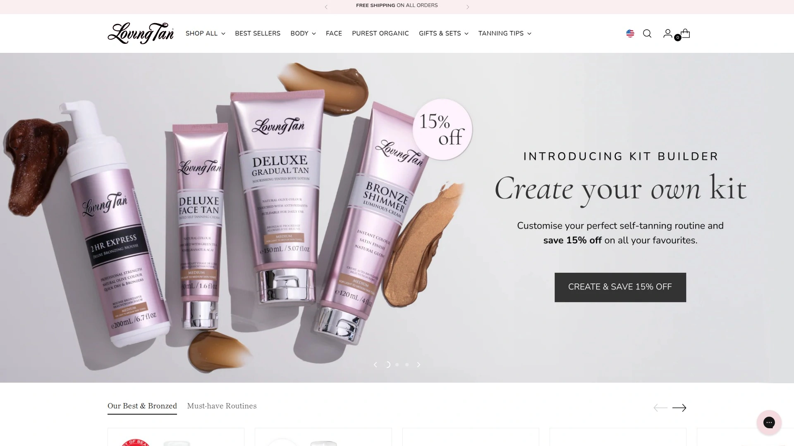
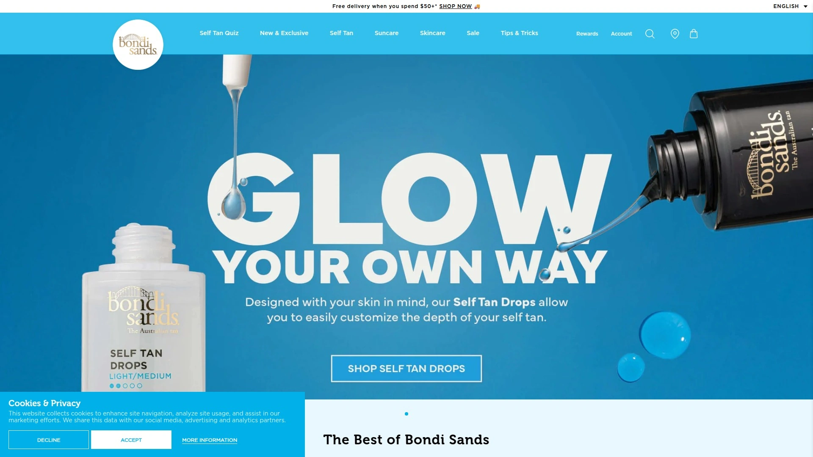
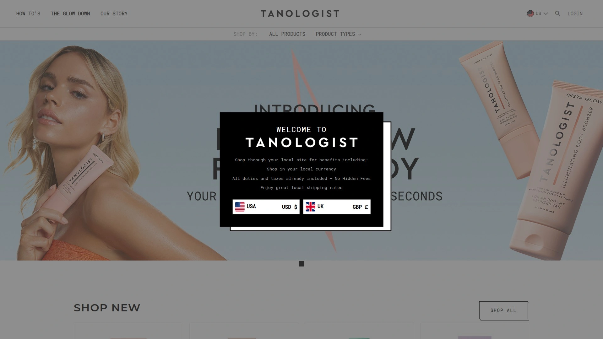
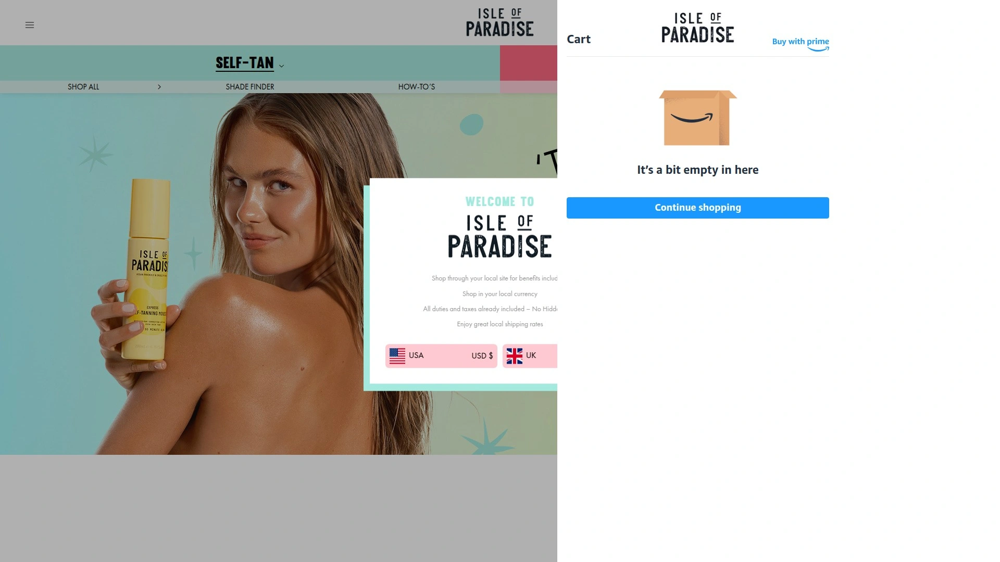
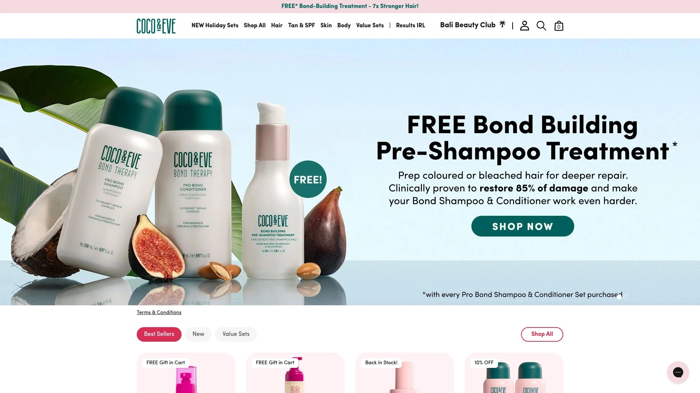
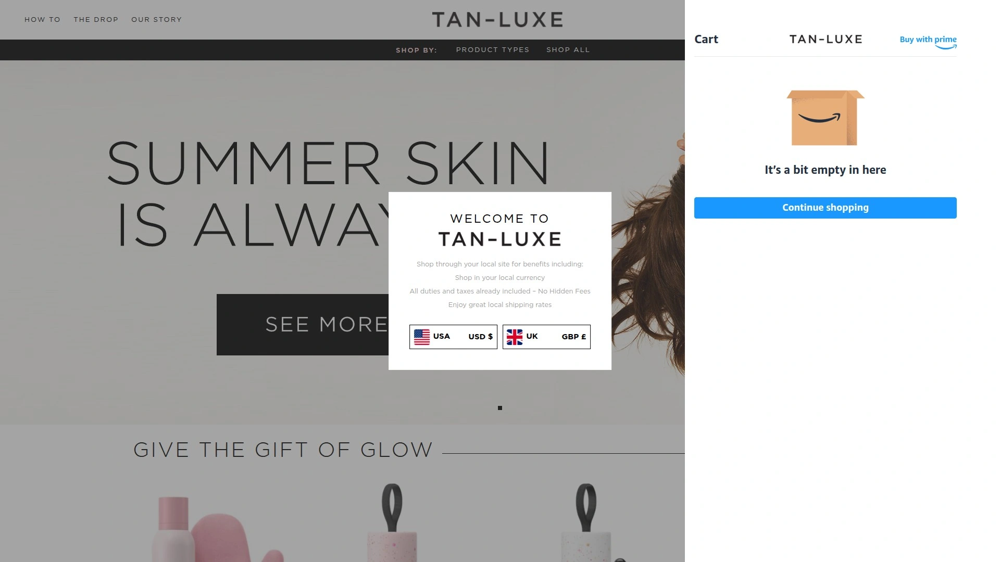
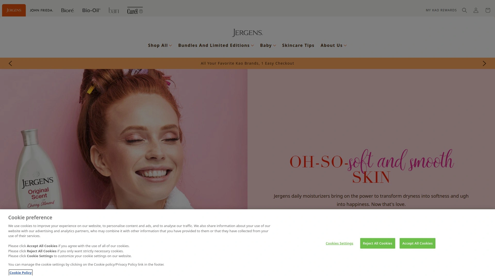
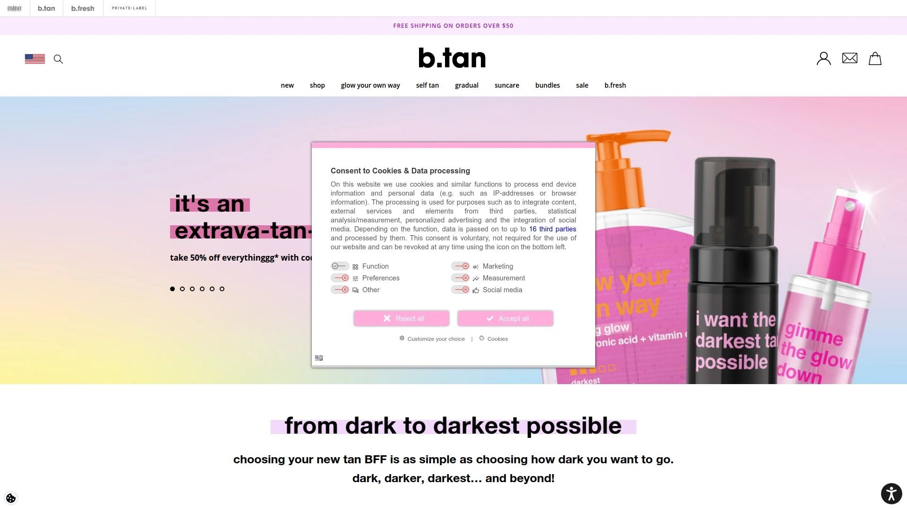
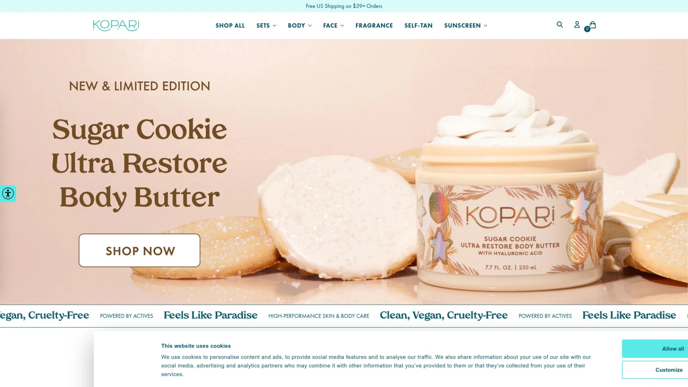

# Top 12 Self-Tanning Brands Ranked in 2025 (Latest Compilation)

Finding a self-tanner that doesn't turn you orange or streak like a zebra used to feel impossible. Now, getting a natural-looking glow is easier than ever with formulas that actually understand skin tones, dry quickly, and fade evenly. Whether you want a subtle sun-kissed look for everyday or a deep bronze for special occasions, the right self-tanner makes all the difference in how confident you feel in your skin.

This guide covers the best self-tanning products available right now, from quick-drying mousses to gradual lotions that build color over time. Each brand offers something different—some excel at beginner-friendly application, others deliver the deepest color possible, and a few specialize in face-specific formulas that won't clog pores.

***

## **[Loving Tan](https://lovingtan.com)**

Professional-strength formulas for a deep, natural-looking tan without the salon visit.

Loving Tan built its reputation among beauty editors and influencers for delivering what many consider the most believable tan color available. The brand uses premium, organic, and naturally-derived ingredients combined with salon-strength erythrulose for a deep olive tone that lasts significantly longer than standard self-tanners. Charlotte Tilbury mentioned in The New York Times that she relies on Loving Tan for its believable color, while publications like Grazia note it rivals professional spray tans in longevity.

The 2 HR Express Mousse line gives you control over your tan depth—rinse after one hour for light color, two hours for medium, or leave it on for three hours for the deepest bronze. The tinted formula helps guide your application so you can see exactly where you've applied product, reducing the chance of streaks or missed spots. Reviews consistently mention the mousse goes on smoothly and the color develops without orange undertones, even on fair skin.

Face-specific products like the Deluxe Face Tan come in medium and dark shades formulated to work with facial skin without causing breakouts. The brand also offers gradual tanning lotions that build color slowly over multiple applications, perfect for maintaining your tan or easing into self-tanning if you're nervous about going too dark too fast. The formulas are paraben-free and contain moisturizing ingredients that help your skin stay hydrated while tanning.

Application is straightforward with a mitt—users report the product spreads easily and dries within 10-15 minutes without feeling sticky. The tan typically lasts about a week before fading, and when it does fade, it does so evenly rather than in patches. Loving Tan products are available at Ulta, Target, and through their official website, with prices ranging from $30-$65 depending on the product and size.

***

## **[St. Tropez](https://us.sttropeztan.com)**

Award-winning express tanning with customizable depth and mood-boosting fragrance.

St. Tropez Self Tan Express Mousse has won Allure's Best of Beauty Award three times, making it one of the most recognized names in self-tanning. The 3-in-1 formula lets you decide how dark you want to go—shower after one hour for a light tan, two hours for medium golden bronze, or wait three hours for deep, dark color. This flexibility makes it practical for both beginners who want to start subtle and experienced tanners looking for dramatic results.

The formula uses 100% natural tanning actives and is completely vegan-friendly, free from parabens and harsh chemicals. Instead of the typical self-tanner smell that lingers for days, St. Tropez developed a signature fragrance that's actually pleasant. The tinted mousse provides a guide color during application, so you can see exactly where you've applied product and blend it properly before it dries.

Their Purity Bronzing Water Face Mist is particularly popular for facial tanning—you hold the bottle about six to eight inches from your face and spray evenly. Multiple users on Reddit confirm it develops without looking splotchy when you follow the distance guidelines. The water-based formula feels lighter than traditional self-tanners and works well under makeup once fully developed.

The mousse dries quickly and doesn't transfer onto clothes or sheets once dry, which solves one of the biggest complaints people have about self-tanners. Users with various skin tones report natural-looking results that last a full week. The even fade means you won't end up with patchy spots on your knees or elbows as it wears off. St. Tropez products are widely available at Ulta, Sephora, and other beauty retailers, typically priced between $33-$48.

***

## **[Bondi Sands](https://bondisands.com)**

Australian-made formulas inspired by beach culture, offering salon-quality tans at accessible prices.

Bondi Sands brings Australian tanning expertise to the mass market with formulas designed to give you that naturally bronzed beach look. The brand's philosophy centers on making salon-quality self-tanning accessible to everyone, with products that hydrate and nourish skin while delivering color. Their formulas are owned and made in Australia, drawing inspiration from the country's beach lifestyle and understanding of tanning.

The 1 Hour Express Self Tanning Foam is a standout product—users with fair skin report leaving it on for just 90 minutes produces a natural medium tan without any orange tones. The foam texture spreads easily and dries relatively quickly compared to some mousses. You can control the depth by adjusting how long you leave it on before rinsing, similar to express tanners from premium brands but at a lower price point.

Their Technocolor line includes innovative formulas with color-correcting technology, while the Liquid Gold option provides a visible guide color during application. For those who prefer milk formulas, Bondi Sands offers a Self Tanning Milk that blends well and doesn't dry out skin as much as mousses can. The gradual tanning options let you build color slowly over several days, reducing the risk of going too dark too fast.

Bondi Sands products contain skin-loving ingredients and are formulated to be vegan-friendly. The brand offers everything from instant airbrush tans that wash off to long-lasting self-tan foams, giving you options depending on whether you need temporary color for an event or a longer-lasting tan. Products are available at Ulta, Target, and online, typically priced between $15-$36, making them one of the more budget-friendly options without sacrificing quality.

***

## **[Tanologist](https://www.tanologist.com)**

Dermatologist-approved, vegan, and cruelty-free self-tanning at drugstore prices.

Tanologist has gained a dedicated following for delivering quality results at prices that won't wreck your budget. The brand emphasizes dermatologist-approved formulas that are 100% vegan and cruelty-free, making it appealing to those who care about both their skin and ethical product sourcing. Despite the lower price point compared to luxury brands, users consistently report professional-looking results.

The Self Tan Drops are particularly popular—you can mix them into your regular body lotion or moisturizer to customize your tan depth. Start with just a few drops to test the color, then adjust based on your preference. Users with porcelain skin mention the drops create a natural color without orange undertones, though they recommend taking your time during application to avoid mistakes on areas like feet and ankles. The drops smell less intense than many self-tanners, though some scent is still present.

Their Express Self Tan Mousse applies easily with a mitt and develops quickly, giving you visible color within hours. The Tinted Mousse provides a guide color so you can see where you've applied product, while the regular mousse goes on clear—both deliver the same final result. For those who want extremely gradual color, the Hydrating Gradual Tan Lotion builds a subtle bronze over multiple applications without the commitment of a full self-tanner.

The Insta Glow Illuminating Face Bronzer and Self Tan Face Mist offer facial-specific options that won't clog pores or interfere with your skincare routine. Tanologist products are widely available at Target, Ulta, and drugstores, with most items priced between $12-$22. This accessibility makes it easy to try without a major investment, and the quality means you won't feel like you're compromising just to save money.

***

## **[Isle of Paradise](https://theisleofparadise.com)**

Color-correcting self-tanning with shades matched to your specific skin tone and concerns.

Isle of Paradise revolutionized self-tanning by introducing color-correcting technology that addresses specific skin tone needs. Their products come in three distinct color families—Peach for fair/cool tones, Green for light/medium tones, and Violet for medium/dark tones. This approach helps counteract unwanted undertones and ensures the tan develops into your most natural-looking color rather than a one-size-fits-all shade.

The Self-Tanning Drops give you complete control over intensity—mix them into your moisturizer using more or fewer drops depending on how dark you want to go. The drops work for both face and body, making them a versatile option if you don't want to buy separate products. They're particularly good for maintaining a tan between full applications or for beginners who want to build confidence slowly.

Their Self-Tanning Mousse comes in Light, Medium, and Dark options within each color-correcting family, so you can fine-tune both your depth and tone. The mousse applies smoothly with a mitt and dries without leaving a sticky residue. Users appreciate that the formula doesn't have an overwhelming self-tanner smell, and the color develops gradually over several hours so you can monitor the results.

Isle of Paradise products are vegan and cruelty-free, formulated with ingredients like DHA (the tanning active), chia seed extract, avocado oil, and other skin-nourishing components. The brand focuses on making self-tanning feel like a skincare routine rather than a purely cosmetic process. Products are available at Sephora and through their website, with prices typically ranging from $28-$44. The innovative color-matching approach makes it worth trying if you've struggled to find self-tanners that don't look muddy or orange on your particular skin tone.

***

## **[Coco & Eve](https://www.cocoandeve.com)**

Fast-drying foam with tropical scents and flexible wear time for customizable results.

Coco & Eve's Sunny Honey Bali Bronzing Foam has developed a loyal following for its ease of use and natural-looking results. The formula dries quickly and doesn't feel sticky, which means you can get dressed sooner and go about your day without worrying about transfer. You can leave it on anywhere from two to eight hours depending on how dark you want your tan, giving you flexibility based on your schedule and desired intensity.

The product has greenish-olive undertones when first applied, which can look alarming if you're not expecting it, but the color develops into a natural bronze without orange tones. This is actually the color-correcting technology at work—those green tones help neutralize any orange or red undertones in your skin. Users who've stuck with the product through the initial application phase consistently report beautiful, even results.

The Antioxidant Face Tanning Micromist offers a convenient spray application for your face. The applicator delivers a powerful, even mist that develops into natural-looking color. While it does have a stronger smell than some facial tanners, applying it in the evening before bed minimizes this concern since the scent dissipates overnight. The face mist is one of the easier facial tanning products to use according to multiple reviews.

Coco & Eve products contain antioxidants and natural ingredients designed to nourish your skin while tanning. The tan lasts about a weekend or through a special occasion—not the longest-wearing option available, but perfect if you want temporary color for an event without a week-long commitment. Products are available at Ulta and through the Coco & Eve website, priced around $28-$39. The tropical scent and quick application make it feel less like a chore and more like a pampering ritual.

***

## **[Tan-Luxe](https://tan-luxe.com)**

Luxury self-tanning drops and serums that customize to your exact preferences.

Tan-Luxe elevated self-tanning into the luxury skincare category with their innovative drops that you add to your existing moisturizer. The Body Drops and The Face Drops let you completely customize your tan by deciding how many drops to use—start with one or two and increase as you get comfortable. This approach eliminates the guesswork and anxiety of traditional self-tanners, putting you in full control of the final color.

The Gradual Illuminating Gradual Tan Lotion is a standout product that delivers buildable color over multiple applications. It contains raspberry seed oil to moisturize and condition skin while gradually developing a golden glow. Users report seeing a difference the next day, with the full effect developing after two to three consecutive applications. The color looks natural and lasts about a week, which is impressive for a gradual tanner.

For those who want faster results, the Super Glow Body Hyaluronic Self-Tan Serum combines the hydrating benefits of hyaluronic acid with self-tanning actives. The color develops more subtly than traditional tanners, making it ideal for maintaining a tan or adding a light glow without drama. The formula doesn't streak easily even when applied without mixing into lotion, though the color is definitely on the lighter side.

The Water Tanning Water develops in as little as 30 minutes for those who need quick results before an event. Tan-Luxe products are formulated with skincare-grade ingredients and don't stain sheets or clothing once dry. The drops approach means you can use them with your favorite moisturizer rather than changing your entire routine. Products are available at Sephora and through Tan-Luxe's website, priced between $50-$65. The higher price reflects the luxury positioning and the fact that a bottle of drops lasts significantly longer than a bottle of mousse since you only use a few drops per application.

***

## **[Bali Body](https://us.balibodyco.com)**

Natural tanning oils and self-tan products with ultra-hydrating formulas.

Bali Body combines self-tanning with serious skincare benefits, creating products that deliver color while actually improving your skin's condition. The brand emphasizes hydration and nourishment, incorporating ingredients like hyaluronic acid, vitamin E, and aloe vera into their formulas. This approach means you're not just tanning—you're treating your skin to beneficial ingredients at the same time.

The Self Tanning Body Milk has become a cult favorite for its smooth application and natural results. The milk texture feels luxurious and spreads easily without the dryness that some mousses can cause. Users report it blends well with different skin tones, leaving an even bronze without patchiness or redness on the face. The formula works particularly well for those who find traditional mousses too drying.

Their Ultra Dark Express Aerated Self Tan Foam is designed for those who want the deepest possible color. You can rinse it off after one hour for dramatic results, or leave it on longer for an even more intense bronze. The foam texture feels lighter than traditional mousses and absorbs quickly. The Gradual Tanning Butter provides a more subtle approach, building color slowly over multiple days while delivering intense moisture.

The new Clear Self Tan Gel is particularly innovative—it's completely transparent with no bronzers or dyes, meaning zero transfer onto towels, sheets, or clothing. The rinse-free formula lets you apply it and go about your day while it develops, perfect for time-sensitive situations. Bali Body products are available at Ulta and through their website, priced between $24-$36. The focus on hydration makes these products ideal if you have dry skin or live in a climate that strips moisture from your skin.

***

## **[Jergens](https://www.jergens.com)**

Trusted gradual tanning moisturizers for natural-looking color that builds over time.

Jergens Natural Glow revolutionized drugstore self-tanning by creating a gradual tanning moisturizer that actually works. Unlike intense mousses that can go wrong quickly, the gradual approach builds color slowly over multiple applications, giving you time to adjust and stop when you reach your desired shade. This makes it incredibly forgiving for beginners or anyone nervous about self-tanning.

The formula contains antioxidants and Vitamin E, so you're moisturizing your skin with every application rather than drying it out. The lotion absorbs within 5-10 minutes, faster than many self-tanners, and doesn't leave a sticky mess or transfer onto clothes. Users with extremely pale skin report that the medium to deep shade (rather than the fair shade) gets them to their desired color faster—it takes just two applications to see significant results instead of four.

The color develops naturally without the orange tones that plagued early self-tanners. Because you apply it daily like regular lotion, it becomes part of your existing routine rather than a special event requiring time and planning. The gradual nature also means the tan fades evenly over time—when you stop applying it, the color slowly returns to your natural shade without weird patches.

Jergens offers in-shower formulas that you apply in the final minutes of your shower, making the process even easier. The product is widely available at drugstores, Target, Walmart, and grocery stores, typically priced between $9-$15. This accessibility and foolproof application make it the perfect starting point for self-tanning beginners, though experienced tanners also appreciate having a low-maintenance option for maintaining color between more intensive tanning sessions.

***

## **[b.tan](https://btan.rocks)**

Bold, affordable self-tanners with attitude and surprisingly sophisticated formulas.

b.tan approaches self-tanning with personality and humor, but don't let the playful branding fool you—the formulas deliver professional results at prices that make self-tanning accessible to everyone. The brand emphasizes using naturally-derived, vegan-friendly ingredients that are cruelty-free, all packaged in recyclable materials. They want you to tan your own way without breaking the bank or compromising your values.

The Love at First Tan 1 Hour Self Tan Mousse is a violet-based formula that eliminates orange tones by counteracting warm undertones in your skin. You can rinse it after one hour for results or leave it on for four-plus hours for dramatically darker color. At just $12.99 for a full-size bottle, it's one of the most affordable options available, yet delivers results comparable to products costing three times as much.

Their Tanned AF Self Tan Mousse lives up to its bold name by providing deep, rich color that lasts. The lightweight mousse spreads easily, dries fast, and creates a streak-free finish with proper application technique. The Clear Self Tan Gel is particularly innovative—it applies like lotion, requires no rinsing, and gives you the same long-lasting results as their mousse without the sticky wait time. The lack of guide color means it's not ideal for complete beginners, but experienced tanners love how quick and easy it makes the process.

b.tan products are paraben-free and palm oil-free, formulated without the gross fake tan smell that many self-tanners have. The brand keeps things simple and effective, focusing on delivering what matters—good color, easy application, and no unpleasant surprises. Products are available at Ulta, Target, and through their website, with most items priced between $10-$18. The combination of quality and affordability makes b.tan perfect for teens and college students getting into self-tanning, or anyone who wants to experiment without spending a fortune.

***

## **[Kopari](https://koparibeauty.com)**

Coconut-infused self-tanning with skincare benefits and customizable intensity.

Kopari built their brand around the benefits of coconut oil, and they've brought that philosophy to their self-tanning line. The Gradual Self-Tanning Mousse combines tanning actives with nourishing ingredients, creating a product that treats your skin while delivering color. The mousse has a quick 30-second dry time and smells like guava, making the application process more pleasant than traditional self-tanners.

The Gradual Self-Tanning Face Serum is designed specifically for facial use, formulated with skincare in mind. You can use 4 drops for a light tan, 6 for medium, or 8 for deep color, adjusting based on your preference. The serum contains niacinamide, though you should be mindful not to use too many drops since excessive niacinamide can cause irritation. The serum looks shimmery in the bottle but applies clear without glitter, and it can even work as a makeup primer once dry.

Unlike some face tanning drops that go on completely clear, the Kopari serum has a slight tint so you can see where you've applied it. This visibility helps prevent missed spots or uneven application. The tan is gradual, developing over several hours and building with daily application. Users report the tan lasts a full four days even with an exfoliating skincare routine, which is impressive staying power for a gradual product.

For best results with the face serum, apply moisturizer first if you have dry skin—this prevents the serum from drying out your face and allows you to leave it on longer for better color development. The products are fragrance-free and don't develop the typical self-tanner smell. Kopari self-tanning products are available at Ulta and through their website, priced between $32-$36. The coconut-based formulas and skincare-first approach make them ideal if you want your self-tanner to actually benefit your skin rather than just sitting on top of it.

***

## **[MineTan](https://us.shop.minetanbodyskin.com)**

Professional spray tan quality in at-home formulas with 1-hour express technology.

MineTan bridges the gap between professional spray tans and at-home self-tanning with formulas that deliver salon-quality results. The brand emphasizes that self-tanning should be as unique as each person using it, offering a wide range of shades and finishes beyond the standard light, medium, and dark. Their philosophy is that you should be able to customize your bronze glow based on your skin type, tone, and desired finish.

All MineTan formulas feature 1 Hour Express Tan technology with quad bronzing that speeds up the tanning process. You control the depth by timing—leave it on for one hour for natural results, two hours for medium color, or three-plus hours for darker, deeper bronze. This flexibility means one product can serve multiple purposes depending on the occasion and how much time you have.

The formulas contain PETA-approved, skin-loving ingredients including moisturizing antioxidants and oils like argan oil, avocado oil, coconut oil, coconut water, and shea butter. Every product is paraben-free, uses naturally-derived DHA (the tanning active), and is vegan-friendly. MineTan positions their products as where cosmetics and skincare meet tanning—you're not just changing your color, you're giving your skin actual therapeutic benefits.

The brand offers both retail self-tanners for home use and professional spray tan solutions for salon technicians. The professional line includes True Bronze Tones, Color Base formulas, and specialty Tanning Treatments for specific client needs, from golden sun-kissed glows to ultra dark tans. MineTan products are available through their website and select retailers, with at-home products typically priced between $30-$40. The professional-grade formulas and extensive shade range make MineTan worth exploring if you've struggled to find the exact tone you want from other brands.

***

## FAQ

**Which self-tanner works best for beginners who've never used one before?**

Gradual tanning lotions like Jergens Natural Glow or Tanologist Hydrating Gradual Tan offer the safest starting point because they build color slowly over multiple days. You apply them like regular lotion, wait a few minutes to dry, and you're done—no rinsing required. If you prefer faster results, choose a mousse with a guide color like Loving Tan or St. Tropez Express so you can see exactly where you've applied product and blend it properly before it dries.

**How do I avoid streaks and orange tones when applying self-tanner?**

Exfoliate your entire body the day before tanning to remove dead skin cells, paying extra attention to dry areas like knees, elbows, and ankles. Always use a tanning mitt rather than your bare hands—it creates even application and prevents stained palms. Choose a formula designed to counteract orange (violet-based or green-toned products work best), and use less product on areas that absorb more color like joints and feet. Apply in circular motions and blend thoroughly, then lightly go over hands and feet with whatever residue is left on your mitt.

**How long does self-tanner typically last, and how do I make it fade evenly?**

Most self-tanners last 5-7 days before fading noticeably, though some formulas like Loving Tan can last over a week with proper care. To extend your tan, moisturize daily with an unscented lotion and avoid harsh exfoliants or long hot baths that strip the color. When you're ready for it to fade, use a tan remover or exfoliating mitt in the shower. For even fading, continue moisturizing as it disappears—dry skin causes patchy fading while hydrated skin fades uniformly across your body.

---

## Conclusion

Self-tanning has come incredibly far from the orange, streaky disasters of the past. Modern formulas understand skin tones, dry quickly, smell better, and fade naturally, making it easier than ever to maintain a year-round glow. Whether you want the deep, long-lasting results of **[Loving Tan](https://lovingtan.com)**—particularly ideal for achieving that professional salon bronze at home—or prefer the gradual, low-commitment approach of drugstore options, there's genuinely a self-tanner that fits your lifestyle and skill level. The key is choosing a formula that matches both your desired result and how much time you want to spend on application and maintenance.
